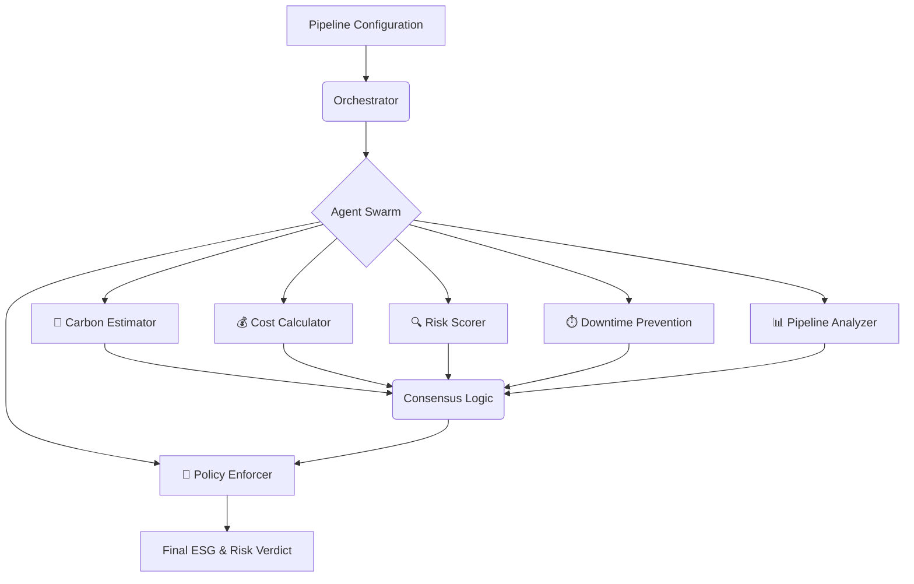

# <p align="center">🌿 GreenOps AI</p>
<p align="center">
  <b>The Intelligent Multi-Agent ESG & DevOps Platform</b><br>
  <i>Empowering sustainable, cost-efficient, and resilient cloud infrastructure.</i>
</p>

<p align="center">
  
  
  
  
</p>

---

## 🌟 Vision
In the modern cloud era, infrastructure is no longer just about performance—it's about **Sustainability** and **Efficiency**. **GreenOps AI** bridges the gap between DevOps and ESG (Environmental, Social, and Governance). Our platform leverages a sophisticated multi-agent system to ensure every line of CI/CD code contributes to a greener planet and a leaner budget.

## 🧠 Intelligent Agent Orchestration
GreenOps AI utilizes the **Microsoft Agent Framework** to coordinate six specialized AI agents that analyze your infrastructure in parallel:



### 🤖 The Agent Swarm
*   **🌱 Carbon Estimator**: Computes carbon intensity based on regional energy mix and compute consumption.
*   **💰 Cost Calculator**: Provides real-time pricing analysis and long-term cost projections.
*   **🔍 Risk Scorer**: Identifies security vulnerabilities and misconfigurations using GPT-4o intelligence.
*   **⏱️ Downtime Prevention**: Predicts potential outages by analyzing redundancy and health probe configurations.
*   **📊 Pipeline Analyzer**: Deciphers complex CI/CD workflows to identify bottlenecks and optimization points.
*   **📜 Policy Enforcer**: The final decision-maker, reconciling metrics against organizational ESG standards.

---

## 🚀 Key Features

### 📡 Real-time ESG Intelligence
Get instant ratings (A to F) on your infrastructure's environmental impact before you even deploy.

### 🛡️ Automated Resilience
Predict downtime before it happens. Our **Downtime Prevention Agent** suggests proactive infrastructure changes like health probes and multi-region redundancy.

### 📉 Cost-to-Carbon Correlation
Understand the direct link between infrastructure spend and carbon footprint, allowing for data-driven trade-off decisions.

### 📋 Full Compliance Reporting
Generate automated HTML audit reports for every deployment, ready for internal transparency or regulatory requirements.

---

## 🛠️ Technology Stack

| Layer | Technologies |
| :--- | :--- |
| **Brain** | Azure OpenAI (GPT-4o), Microsoft Agent Framework |
| **Backend** | FastAPI, Pydantic, Python 3.11+ |
| **Cloud** | Azure Container Apps, Azure Container Registry |
| **Persistence** | Azure Table Storage, Azure Blob Storage |
| **Infrastructure** | Bicep, Docker, GitHub Actions |
| **Monitoring** | Application Insights, Log Analytics |

---

## 🚦 Getting Started

### 📋 Prerequisites
- Azure Subscription
- Azure OpenAI API Access
- Docker Desktop

### ⚙️ Environment Configuration
Initialize your environment in a `.env` file:
```env
AZURE_OPENAI_API_KEY=your_secure_api_key
AZURE_OPENAI_ENDPOINT=https://your-resource.azure.com/
AZURE_OPENAI_DEPLOYMENT_NAME=gpt-4o
AZURE_STORAGE_CONNECTION_STRING=DefaultEndpointsProtocol=https;...
```

### 🏃 Quick Launch
```bash
# Clone the repository
git clone https://github.com/Kaushikyerra/ai-esg-multiagent-platform.git
cd ai-esg-multiagent-platform

# Install dependencies
pip install -r requirements.txt

# Start the platform
python orchestrator/main_maf.py
```

---

## 🧪 Validated Performance
Our platform is backed by a rigorous testing suite ensuring 100% accuracy in agent logic and infrastructure reliability.

```bash
# Run the integration suite
python tests/test_agents.py
```

---

<p align="center">
  <b>Built with ❤️ for the AI Dev Days Hackathon 2026.</b><br>
  <i>Leading the transition to sustainable cloud intelligence.</i>
</p>
